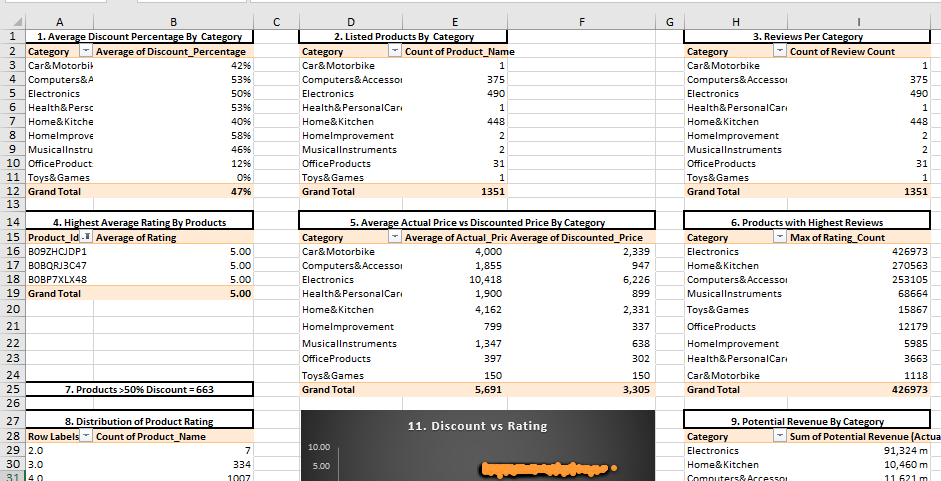

# 📦 Amazon Product Review Analysis (DSA Project)

This project is part of my Data Analysis course capstone project. As a Junior Data Analyst at **RetailTech Insights**, I was tasked with analyzing Amazon product and review data to provide insights that can guide product improvement, marketing strategies, and customer engagement.

---

## 📁 Dataset Overview
- **Source**: Amazon product pages (scraped data)
- **Total Records**: 1,465 products
- **Total Fields**: 16 columns
- **Key Fields**:  
  - `product_name`  
  - `category`  
  - `actual_price`, `discounted_price`, `discount_percentage`  
  - `rating`, `rating_count`  
  - `review_title`, `review_content`

---

## 🎯 Objectives

The following business questions were explored using **Excel** with the help of pivot tables, charts, and calculated columns:

1. What is the **average discount percentage** by product category?
2. How many **products are listed** under each category?
3. What is the **total number of reviews** per category?
4. Which products have the **highest average ratings**?
5. What is the **average actual price vs discounted price** by category?
6. Which products have the **highest number of reviews**?
7. How many products have a **discount of 50% or more**?
8. What is the **distribution of product ratings** (e.g., 3.0, 4.0, etc.)?
9. What is the **total potential revenue** by category?  
   *(Estimated as actual_price × rating_count)*
10. How many unique products fall into each **price range bucket**?  
    *(< ₹200, ₹200–₹500, > ₹500)*
11. How does the **rating relate to discount percentage**?
12. How many products have **fewer than 1,000 reviews**?
13. Which categories have products with the **highest discounts**?
14. Who are the **Top 5 products** combining high ratings and review volume?

---

## 📊 Dashboard

A clean, interactive dashboard was created in **Excel** to visualize insights such as:
- Product count by category  
- Total reviews by category  
- Average rating by category  
- Revenue potential by category  
- Price range distribution  
- Top-rated and top-reviewed products  
- Discounts vs ratings relationship

The dashboard helps e-commerce sellers quickly identify product performance trends and areas of opportunity.

---

## 🛠 Tools Used
- **Microsoft Excel**
  - Pivot Tables & Charts
  - Calculated Columns
  - Conditional Formatting
  - Dashboard Design
  ## 📊 Dashboard Preview

---

## 📌 Key Insights
- Certain categories offer higher average discounts, which may impact rating perception.
- Products with a balanced combination of **high rating and high review count** are most reliable.
- The majority of products fall into the **₹200–₹500 price range**.
- **High discount percentages** don't always lead to better ratings — customer satisfaction depends on more factors.
- Top-selling categories are also the most reviewed, indicating strong customer engagement.

---

## 📁 Repository Contents

# 📥 Download the Excel File

[📊 Excel Dashboard Workbook](Amazon_Product_Review_Analysis.xlsx)

- `https://docs.google.com/spreadsheets/d/1435fxWmmvzrQGNZ5IOguQOsQlK8hvTqw/edit?usp=drivesdk&ouid=116323669354298808896&rtpof=true&sd=true` – Cleaned dataset, pivot tables, and dashboard
- `README.md` – This project summary
- *Screenshots of the dashboard or charts*

---

## 🙋‍♀️ About Me

**Oluwatobiloba Jegede**  
Junior Data Analyst | Virtual Assistant | Data Entry Specialist  
📍 Osun State, Nigeria.
📱 +234 803 2072273  
📧 leah.oloidi@gmail.com  
🔗 [LinkedIn](https://bit.ly/OluwatobilobaJegedeLinkedin)

This project reflects my growing skills in data analysis and business intelligence using Excel. I am open to collaboration and new opportunities in remote analytics roles.
If you find this useful, feel free to ✴ this repo and use it for your learning.

---
